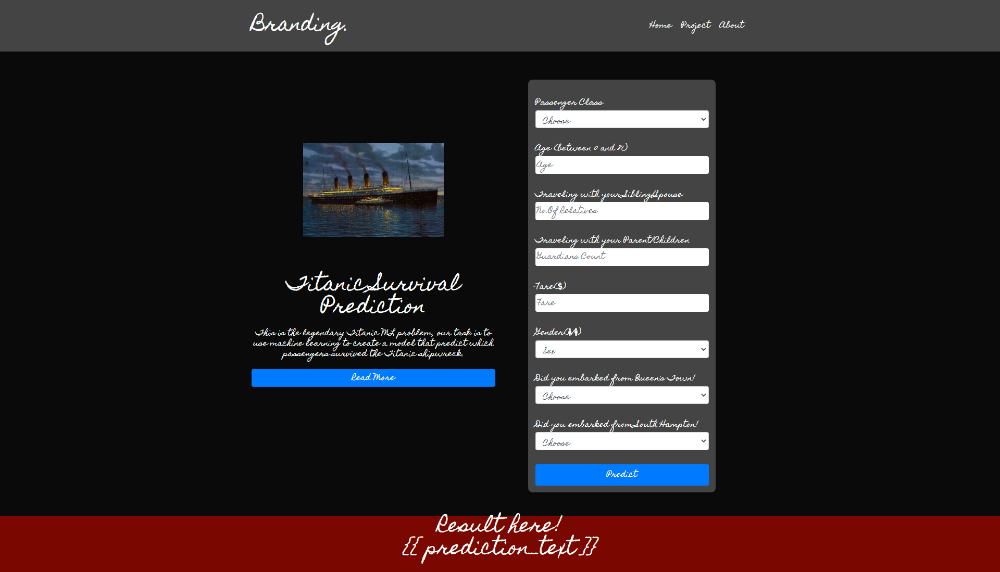

# Titanic Survival Prediction Page

A simple HTML-CSS frontend. For predicting :“what sorts of people were more likely to survive?” using passenger data (ie name, age, gender, socio-economic class, etc).

## How To Run
1. `git clone`
2. `npm install`
3. `npm start`

<h1>Screenshots</h1>

